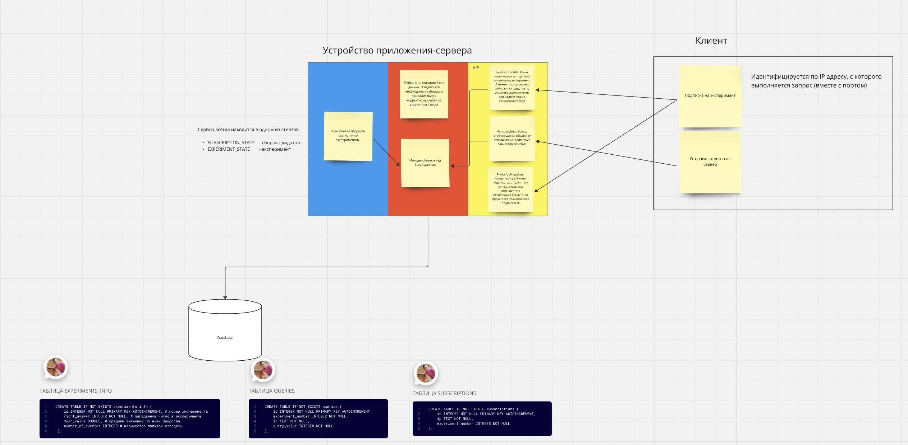

# clientServerApp

Miro с архитектурой приложения: https://miro.com/app/board/uXjVLTLLCas=/

Общий пайплайн работы с приложением:

1) Запустить приложение-сервер (server/main.go). Оно запустится на 8080 порте, инициализирует базу данных и начнет слушать клиентов на предмет подписки. При этом при добавлении каждого нового клиента будет перерисовываться таблица с участниками, зарегистрированными на эксперимент

2) Запустить приложение клиента (client/main.go). Как только оно запустится, оно начнет слушать сервер на предмет подписки. Как только подписка будет произведена, приложение клиента перейдет в режим ожидания начала эксперимента. После этого клиенту будет предложено вводить свои варианты ответа до тех пор, пока он не отгадает либо эксперимент не закончится. Процесс подписки на эксперименты итеративный.

 

Общие архитектурные заметки:

* В данном случае в качестве данных об эксперименте были добавлены лишь среднее и количество попыток. При желании можно добавить другие статистики - их число легко масштабируется.

* Сейчас клиенты идентифицуруются по IP. Это сделано для упрощения и возможности отсылания запросов обратно на клиенты. В случае масштабирования можно перейти на идентификаторы, а IP сохранять как информацию о клиенте.

* Можно было поднять сервер в докере, но решил, что для такого проекта программы-цикла будет достаточно
